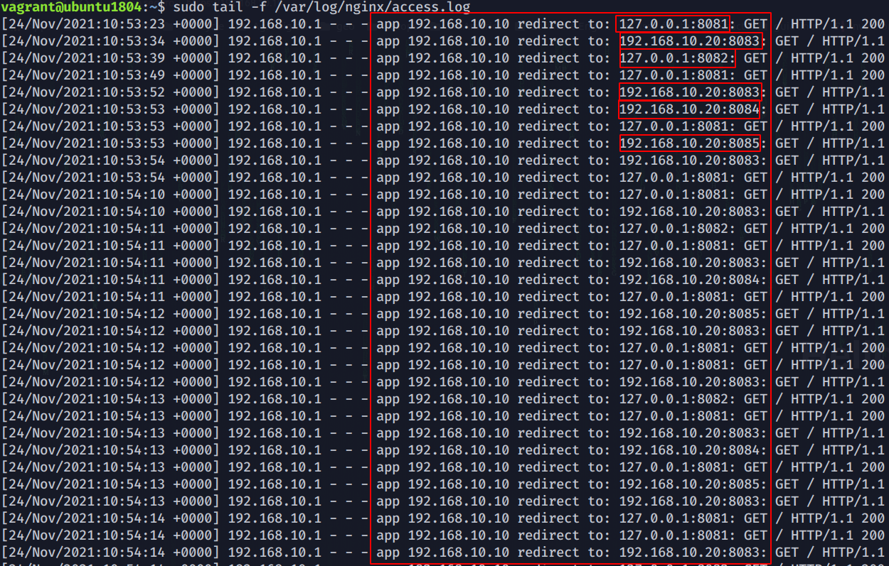

# Caso de Estudo - Load Balancer

Arquitetura do Projeto

## Logs de acesso

## Testes com JMeter

Exemplo com 2000 Requisições - Todas as requisições foram bem sucedidas

Gráficos de requisições

## Testando com Rate Limit habilitado

É possível notar que as primeiras 11 requisições foram bem sucessidas seguido de algumas falhas alternando com algumas requisições bem sucessidas. Após 40 requisições não houve mais nenhum evento bem sucedido.

## Grafico de requisições com Rate Limite ativado

No gráfico a seguir podemos notar que em pouquíssimo tempo houve um grande número de requisições causando a formando um "U" invertido seguido de uma queda considerável no número de acessos, esse comportamento ocorreu devido a ativação do Rate Limit para o IP de origem penalizando-o com tempo de espera maior.

